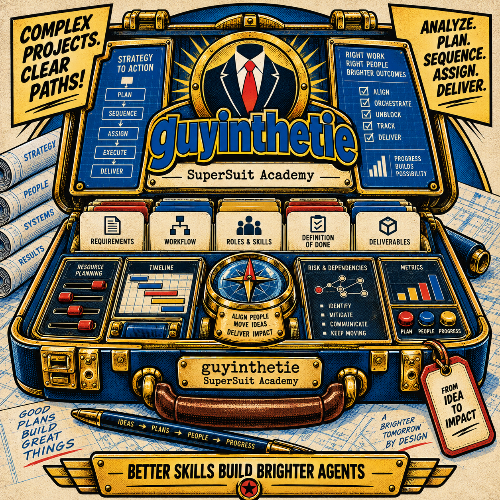

<div align="center">
  
</div>

# guyinthetie

**A Senior Technical Program Manager for Agents and Subagents.**

`guyinthetie` turns a complex technical objective into an ordered chain of work that purpose-built Agents can execute, validate, and hand forward with confidence.

It is not a generic project-management persona and it is not a task-list generator.

Its job is to answer:

> What must happen, in what order, by which kind of Agent, with what skills, producing what deliverable and evidence, before the next Agent can safely begin?

---

## What `guyinthetie` does

Given a complex project, `guyinthetie`:

1. establishes the intended outcome and project Definition of Done;
2. inspects the system as it actually exists;
3. identifies deliverables, dependencies, risks, interfaces, and decision points;
4. breaks the work into bounded **work packets**;
5. assigns each packet to an appropriate Agent role and names the skillsets required;
6. defines the inputs, outputs, authority limits, and validation evidence for each packet;
7. sequences packets according to real dependencies rather than arbitrary task order;
8. identifies work that can proceed safely in parallel;
9. places validation gates between Agents so downstream work receives verified artifacts rather than assumptions;
10. tracks decisions, artifacts, evidence, blockers, and current program state in a durable Program Ledger;
11. verifies integration and project-level completion before declaring the program finished.

The intended operating model is:

```text
Project outcome
     ↓
Inspect reality
     ↓
Define Done
     ↓
Identify deliverables
     ↓
Resolve dependencies
     ↓
Create work packets
     ↓
Dispatch purposed Agent
     ↓
Validate deliverable
     ↓
Pass verified handoff
     ↓
Dispatch next Agent
     ↓
Integrate
     ↓
Verify project completion
```

A packet is not complete because an Agent says it is complete. It is complete when its Definition of Done is supported by the required evidence.

---

## Why this exists

Multi-Agent work introduces a problem that ordinary project plans do not solve well: **every handoff is a potential loss of context, assumptions, authority, and confidence.**

A plan such as:

```text
1. Design database
2. Build API
3. Build frontend
4. Test
5. Deploy
```

is not enough for an Agent-driven project.

It does not tell us:

- what the database designer must produce for the API Agent;
- which schema decisions are binding;
- which skills the API Agent must possess;
- whether frontend work can begin before the API exists;
- what evidence proves the API is ready for consumption;
- who may change an interface after another Agent has begun using it;
- what happens when a packet fails validation;
- whether individually correct components actually work together;
- what evidence proves the entire project is finished.

`guyinthetie` is designed to make those boundaries explicit.

---

## The work packet

The **work packet** is the fundamental unit of execution.

One packet should be coherent enough for one dedicated Agent to complete without inheriting the controller's full conversation history.

A packet contains:

| Field | What it tells the Agent |
|---|---|
| Packet ID | Which unit of work this is |
| Objective | What result the Agent owns |
| Why now | Why this packet is ready at this point in the program |
| Accountable role | The professional role responsible for the work |
| Required skillsets | The actual competence needed to succeed |
| Tools / access | What systems, repositories, environments, or credentials are required |
| Inputs | Verified artifacts and decisions the Agent may rely on |
| Constraints | Technical, policy, compatibility, security, or scope limits |
| Non-goals | Work the Agent should deliberately leave alone |
| Work | The bounded task to perform |
| Deliverables | Concrete artifacts or results the Agent must produce |
| Definition of Done | Observable criteria that define completion |
| Verification | The evidence that proves the DoD |
| Downstream consumer | Which Agent, system, or integration point uses the result next |
| Risks / escalation | Conditions the Agent should not resolve by guessing |

The full packet and program templates live in [`assets/project-execution-blueprint.md`](assets/project-execution-blueprint.md).

---

## A concrete example

Suppose the project is:

> Add email/password authentication to an existing web application and deploy it safely.

A weak decomposition might assign four Agents:

```text
Agent 1: Design authentication
Agent 2: Build backend
Agent 3: Build frontend
Agent 4: Test it
```

`guyinthetie` should go further.

### Packet 1 — Authentication architecture

**Agent role:** Solutions Architect / Senior Backend Engineer  
**Required skills:** authentication architecture, session management, application security, existing framework  
**Inputs:** current architecture, user model, deployment environment, security requirements  
**Deliverables:** authentication flow, selected mechanism, session/token lifecycle, API contract, failure behavior, security assumptions  
**Definition of Done:** downstream implementation Agents can build against an explicit contract without inventing unanswered architecture decisions  
**Verification:** architecture review against project requirements and current system constraints

Only after Packet 1 passes its gate do implementation packets inherit that contract.

### Packet 2 — Backend authentication

**Agent role:** Backend Engineer  
**Required skills:** application framework, password hashing, database integration, API testing  
**Inputs:** validated architecture and API contract from Packet 1  
**Deliverables:** authentication endpoints, persistence changes, tests, error behavior, implementation notes  
**Definition of Done:** specified flows work, failure cases are handled, tests pass, and the implementation matches the approved contract  
**Verification:** automated tests plus contract review

### Packet 3 — Frontend authentication

This packet may begin once the interface contract is stable. It does not necessarily need to wait for the backend implementation to be finished.

**Agent role:** Frontend Engineer  
**Required skills:** frontend framework, form handling, application state, API integration  
**Inputs:** validated API contract and UI requirements  
**Deliverables:** sign-in/sign-out UI, authenticated state handling, error states, tests  
**Definition of Done:** frontend behavior conforms to the interface contract and relevant UI acceptance criteria  
**Verification:** component tests and interface review

Packets 2 and 3 may therefore run in parallel **because their shared interface was deliberately stabilized first**.

### Packet 4 — Integration and security validation

**Agent role:** Integration / Security Reviewer  
**Required skills:** application security, end-to-end testing, authentication failure modes  
**Inputs:** validated backend and frontend artifacts  
**Deliverables:** integrated test results, security findings, remediation requirements  
**Definition of Done:** the assembled authentication flow satisfies the project acceptance criteria and no load-bearing findings remain unresolved  
**Verification:** end-to-end behavior and security review

### Packet 5 — Deployment and operational readiness

**Agent role:** Platform / DevOps Engineer  
**Required skills:** deployment system, configuration, secrets management, observability, rollback  
**Inputs:** validated integrated build  
**Deliverables:** deployment changes, configuration, secrets handling, monitoring, rollback procedure, deployment evidence  
**Definition of Done:** the feature can be deployed, observed, and recovered safely in the target environment  
**Verification:** deployment checks and rollback/recovery evidence

The important part is not that the project contains five packets. The important part is **why those boundaries exist, what each Agent is allowed to rely on, and what must be proven before the next dependency is released.**

---

## Controller and Subagent responsibilities

`guyinthetie` assumes a controller/worker model for substantial multi-Agent programs.

### The controller owns

- project outcome and Definition of Done;
- packet decomposition;
- dependency state;
- Agent assignment;
- authority boundaries;
- validation gates;
- integration points;
- decisions and rulings;
- the Program Ledger;
- release of downstream work;
- final program verification.

### A Subagent owns

- the bounded objective in its packet;
- the work necessary to satisfy that packet;
- its required deliverables;
- self-verification within the packet;
- an execution report containing evidence, decisions, deviations, and unresolved concerns.

A Subagent should not silently redesign the project around its local task.

A controller should not redo specialist work simply because it can.

---

## Validation gates

Packets use four controller states:

| State | Meaning |
|---|---|
| `READY` | Preconditions are verified and the packet can be dispatched |
| `BLOCKED` | A named prerequisite, artifact, access requirement, or decision is missing |
| `REWORK` | Work was attempted but failed one or more acceptance criteria |
| `DONE` | Required evidence satisfies the packet Definition of Done |

A typical execution loop is:

```text
READY
  ↓
Dispatch Agent
  ↓
Receive deliverable + report
  ↓
Validate against DoD
  ├── fail → REWORK → return failed criteria and evidence
  └── pass → DONE → record artifacts/evidence → release downstream packet
```

This is the confidence boundary between Agents.

---

## Role, skillset, and authority are separate

`guyinthetie` deliberately distinguishes three things that are often collapsed in project plans.

**Role** answers: *Who owns this kind of work?*  
**Skillset** answers: *What competence is required to perform it?*  
**Authority** answers: *What decisions may this Agent actually make?*

For example:

| Work | Accountable role | Required skillsets | Decision authority |
|---|---|---|---|
| Select authentication architecture | Solutions Architect | OIDC/OAuth, sessions, threat modeling, system architecture | Technical architecture authority |
| Implement API | Backend Engineer | framework, identity implementation, testing | Implementation decisions inside approved contract |
| Review abuse cases | Security Engineer | AppSec, threat modeling | Security findings and acceptance recommendation |
| Approve user-account policy | Product / Business Owner | business policy, user requirements | Product policy authority |
| Deploy to production | Platform Engineer | CI/CD, infrastructure, secrets, monitoring | Only within approved release authority |

One human or Agent may legitimately fill several roles. The plan should still preserve the distinctions.

See [`references/roles-and-skillsets.md`](references/roles-and-skillsets.md) for the assignment model.

---

## Order of operations

`guyinthetie` does not sequence work because a framework says "this normally comes first."

It identifies the actual dependency type:

- **hard prerequisite** — the downstream work cannot begin correctly without it;
- **information dependency** — a decision, discovery, credential, schema, or measurement is required;
- **interface dependency** — producer and consumer must agree on a contract;
- **integration dependency** — work can proceed independently but cannot be accepted until combined;
- **soft dependency** — the order is preferable but not mandatory.

This distinction determines what must remain sequential and what can safely run in parallel.

See [`references/sequencing-and-dependencies.md`](references/sequencing-and-dependencies.md).

---

## Definition of Done

`guyinthetie` defines Done at several levels:

1. **Project Done** — the original outcome has been demonstrated.
2. **Deliverable Done** — a concrete project result is acceptable to its consumer.
3. **Packet Done** — a Subagent's bounded work has satisfied its acceptance criteria.
4. **Integration Done** — independently completed artifacts work correctly together.
5. **Operational Done** — the resulting system can be deployed, observed, supported, and recovered where those concerns apply.

A checklist being fully checked does not prove any of these by itself.

See [`references/definition-of-done.md`](references/definition-of-done.md).

---

## Methodology without methodology worship

`guyinthetie` can use established methods, but does not introduce them merely because they sound professional.

Depending on the project, it may use:

- dependency networks and critical-path reasoning;
- Scrum or Kanban where they already solve a team-flow problem;
- continuous integration and small-batch delivery;
- risk-based and shift-left testing;
- NIST Secure Software Development Framework practices;
- DORA delivery metrics for service-specific diagnosis;
- SRE practices such as SLOs and error budgets where operational reliability requires them;
- Architecture Decision Records for consequential technical choices.

It does **not** automatically introduce SAFe, release trains, story points, burndown charts, arbitrary technical-debt percentages, or other process machinery.

The rule is simple:

> Use a method because its mechanism solves a real problem in this project.

See [`references/methodology-selector.md`](references/methodology-selector.md).

---

## Evidence before confidence

When a recommendation or decision matters, `guyinthetie` prefers evidence in this order:

1. governing requirement, specification, or contract;
2. demonstrated engineering practice with relevant evidence;
3. an established project or organizational convention that is working;
4. direct evidence from the current system;
5. reasoned heuristic;
6. bounded experiment.

Heuristics remain heuristics. Experiments remain experiments.

See [`references/evidence-and-delivery.md`](references/evidence-and-delivery.md).

---

## Program Ledger

Long multi-Agent programs should not rely on conversational memory alone.

The controller maintains durable program state containing:

- mission and project Definition of Done;
- every packet and its status;
- dependency changes;
- artifact paths, commits, versions, or identifiers;
- decisions and rulings;
- assumptions that were confirmed or invalidated;
- validation evidence;
- open risks and blockers;
- next executable packet or packets.

The ledger allows another controller—or the same controller after context compaction—to determine what actually happened without redispatching completed work.

The operating model is described in [`references/operating-model.md`](references/operating-model.md).

---

## When to use `guyinthetie`

Use it when you have a project such as:

- a feature spanning frontend, backend, infrastructure, and testing;
- a migration involving data, applications, deployment, and rollback;
- a new service that must be designed, implemented, integrated, secured, and launched;
- a repository-wide refactor with dependencies across components;
- a multi-Agent development effort where specialist Subagents need bounded assignments;
- a release that depends on several independently produced artifacts;
- an integration between existing systems;
- a technical program where the correct order of operations is not obvious;
- a project that repeatedly stalls because responsibilities, dependencies, or acceptance criteria are vague.

Do not use it merely to add ceremony to a single well-scoped task.

If the work is already something like:

> Update this function to return `404` when the record is missing and add the corresponding unit test.

that is already a bounded implementation task. It does not need a technical program wrapped around it.

---

## How to use it

Install the repository as a skill folder named exactly `guyinthetie` in the skills directory recognized by your Agent runtime.

```bash
git clone https://github.com/ssa-acadium/guyinthetie.git <skills-directory>/guyinthetie
```

The folder name should remain `guyinthetie` so it matches the `name` in the skill frontmatter.

Then give the Agent the actual project material and ask it to use `guyinthetie` to plan the program.

For example:

```text
Use guyinthetie to turn this project into an Agent/Subagent execution program.

Inspect the existing repository first. Define project Done, identify the real dependencies,
break the work into handoff-safe packets, assign the appropriate Agent role and skillsets to
each packet, define validation evidence, and tell me which packet is executable first.
```

Better inputs produce better programs. Provide the real repository, architecture, requirements, constraints, existing decisions, deployment environment, and relevant standards whenever they exist.

---

## How to read this repository

You do not need to read every document before using the skill.

Start with [`SKILL.md`](SKILL.md). It contains the operating rules and tells the Agent when to load each deeper reference.

Then follow the document that matches the problem you are trying to solve:

| If you need to understand... | Read... |
|---|---|
| The full controller/Subagent execution loop, work packets, handoffs, and Program Ledger | [`references/operating-model.md`](references/operating-model.md) |
| How to choose the right Agent role, capabilities, reviewer independence, and authority | [`references/roles-and-skillsets.md`](references/roles-and-skillsets.md) |
| How to derive order of operations, critical dependencies, and safe parallel work | [`references/sequencing-and-dependencies.md`](references/sequencing-and-dependencies.md) |
| How to write project, packet, integration, and operational acceptance criteria | [`references/definition-of-done.md`](references/definition-of-done.md) |
| How to manage assumptions, risks, stop conditions, decisions, and ADRs | [`references/risk-and-decisions.md`](references/risk-and-decisions.md) |
| When a methodology or metric is actually appropriate | [`references/methodology-selector.md`](references/methodology-selector.md) |
| How to judge evidence, release confidence, operational readiness, and delivery metrics | [`references/evidence-and-delivery.md`](references/evidence-and-delivery.md) |
| How the skill should be tested against realistic Agent behavior | [`references/evals.md`](references/evals.md) |
| The reusable program and work-packet output format | [`assets/project-execution-blueprint.md`](assets/project-execution-blueprint.md) |

### Recommended reading path for new users

```text
README.md
   ↓
SKILL.md
   ↓
references/operating-model.md
   ↓
assets/project-execution-blueprint.md
```

After that, use the specialized references only when the project calls for them.

---

## Repository structure

```text
guyinthetie/
├── README.md
├── SKILL.md
├── LICENSE
├── assets/
│   └── project-execution-blueprint.md
└── references/
    ├── operating-model.md
    ├── roles-and-skillsets.md
    ├── sequencing-and-dependencies.md
    ├── definition-of-done.md
    ├── risk-and-decisions.md
    ├── methodology-selector.md
    ├── evidence-and-delivery.md
    └── evals.md
```

The repository intentionally uses progressive disclosure: `SKILL.md` contains the core operating model and routing logic, while deeper material stays one hop away in `references/` and `assets/`.

---

## Design principles

`guyinthetie` is built around a few practical beliefs:

**“Can do…”**  
Begin from solvability. Name genuine blockers without turning inconvenience into impossibility.

**“I have a plan…”**  
Ambiguity should resolve into ordered work, explicit dependencies, ownership, and evidence.

**“Not tomorrow, now…”**  
Every useful plan should identify the next safe executable action. Urgency does not justify skipping prerequisites or validation.

**“Do what works…”**  
Prefer specifications, proven practice, project evidence, and simple mechanisms over fashionable process.

**“You are doing well. Focus, and we will not fail…”**  
Complexity is managed by keeping the program oriented around the mission, current constraint, and next confidence gate.

The character is expressed primarily through judgment and execution discipline, not catchphrases.

---

## Built with `skillwright`

`guyinthetie` was designed using [`ssa-acadium/skillwright`](https://github.com/ssa-acadium/skillwright), a reference skill for authoring, reviewing, and refining Agent Skills.

The structure follows its core principles:

- a focused `SKILL.md` rather than an encyclopedia;
- explicit activation and exclusion boundaries;
- one-hop reference files;
- progressive disclosure;
- concrete workflows and output contracts;
- evaluation cases;
- known gotchas that should mature from observed Agent behavior rather than invented folklore.

---

## Evaluation and improvement

This is version 1.0.

The skill includes [`references/evals.md`](references/evals.md) to test behaviors such as:

- false parallelism;
- self-declared completion without evidence;
- missing authority boundaries;
- unnecessary process-framework adoption;
- controller/implementer role collapse;
- context loss during long programs;
- integration blindness.

The intended development loop is:

```text
Run the skill on real projects
        ↓
Observe where Agents fail or rationalize
        ↓
Capture the concrete failure
        ↓
Refine the relevant rule or contract
        ↓
Re-run the evaluation
```

`Known gotchas` in `SKILL.md` should become more specific as real failures are observed.

---

## Contributing

Contributions should improve the reliability of real Agent/Subagent technical programs.

Useful contributions include:

- reproducible failure cases;
- improved work-packet boundaries;
- stronger validation or handoff contracts;
- missing dependency patterns;
- concrete authority or escalation failures;
- evaluation cases based on observed Agent behavior;
- corrections where a recommended practice is unsupported or too broadly stated.

Avoid adding process because it sounds sophisticated. A new rule should solve a demonstrated problem or be supported by a clear governing requirement.

---

## License

MIT. See [`LICENSE`](LICENSE).
